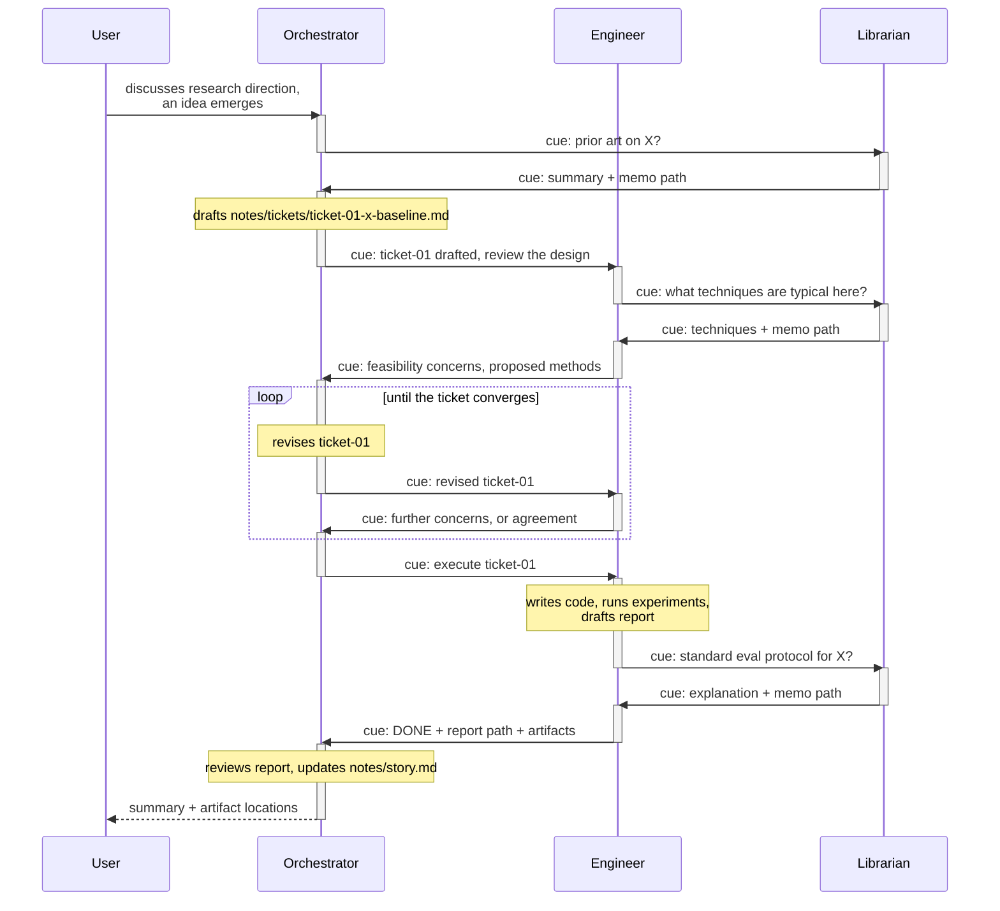

# Multi-Agent Message Exchange

How the lab's sessions talk. Dev-facing: specifies the harness mechanism and
the conventions role prompts rely on. Lab-facing invariants live in
`motif.md`.

## Model: one conversation, several contexts

The lab is not a team working in parallel; it is **one conversation stretched
across several context-isolated sessions**. The point of splitting is
attention: each session keeps a clean, focused context for its niche.
Throughput is a non-goal.

Turn-taking is the discipline: at any moment, typically one party is moving
(an agent mid-turn, or the user composing). Messages pass the turn along.
The user stands above the turn discipline and may speak to any session at
any time.

Vocabulary (musical theme):

- **cue** -- the one and only message unit between agents.
- **playing** -- an agent mid-turn. **counting rests** -- idle with open
  cues, waiting. **tacet** -- idle, nothing owed in either direction.
- The user's status view shows **who carries the theme** (who is playing);
  two voices at once is a canon -- allowed, not encouraged.

## Topology

Three peer pi processes, one per role, each launched via `bin/` with a pinned
session file (`<project>/.pi/sessions/<role>.jsonl`). The user can attach to
any session's TUI live and steer it directly -- direct control of every
agent is a permanent requirement.

All three processes load the same harness extension (from the agent dir) and
self-configure from `HARNESS_ROLE` (set by the launcher). Cues cross process
boundaries over a **per-project message bus**: a unix socket under
`<project>/.pi/harness/`, auto-spawned by the first extension that connects.

Any role can cue any other role. There is no target restriction: initiating
a cue and resolving one are the same call -- a reply is just a cue back.
Deadlock is a non-issue because nothing ever blocks; the worst case is
silence (see deferred stuck detection). Conventions about who *typically*
consults whom (orchestrator dispatches tickets, librarian mostly answers)
live in the role prompts, not in the mechanism.

## The cue primitive

One tool: `cue(target, message)`. No ids, no subjects, no answer
primitive; initiating and resolving are the same call.
Fire-and-forget: the sender's turn continues or ends by its own judgment;
the reply arrives later as an inbound cue.

Bookkeeping, injected into context by the harness and kept current:

- The sender sees: `awaiting cue from <target>`.
- The receiver sees: `<sender> awaits your cue` alongside the message.

Resolution is deliberately crude: **the receiver's next `cue` back to the
sender clears the sender's oldest outstanding await.** No correlation
machinery. The ledger is advisory -- it exists to remind, not to record --
so drift (a reply that was really a new question) costs a stale reminder
line, never a lost task. Durable state lives in artifacts, not in cues.

Queueing rules:

- An agent may hold several outstanding awaits at once (multiple open cues).
- An agent works on **one inbound cue at a time**: the bus keeps a
  per-callee FIFO and delivers the next cue only when the current one
  resolves.
- A cue to a role whose process is not running fails fast ("engineer not
  connected -- launch `bin/engineer`"); the sender keeps its turn.

Delivery: **agent cues are always follow-ups, never steers.** A cue arriving
mid-turn queues behind the current turn and is answered at the next turn
boundary. Agents do not interrupt each other.

The human is exempt from all of this and uses pi's native keybindings:

| Input while an agent works | Delivery |
| -------------------------- | -------- |
| Enter                      | steering message -- lands after the current tool calls, agent adjusts mid-run |
| Alt+Enter                  | follow-up -- lands after the agent finishes all work |
| Escape                     | abort the run; queued messages return to the editor |
| Alt+Up                     | pull queued messages back into the editor |

## Task state lives in artifacts, not in cues

Workflow state (ticket progress, acceptance, what to do next) is carried by
the artifacts themselves -- tickets, reports, memos, notes -- per the
existing workflow skill. The harness v1 adds **nothing** here on purpose: no
passport/status fields, no harness-managed to-do lists. If agents keep track
well enough on their own, the structure stays emergent; if not, structure
(ARS-style passports, per-role todo files) gets added where the pain was
felt.

## Example: initiating a ticket

Reading the diagram: a bar is open while a session is mid-turn. Every cue
closes the sender's bar and opens the receiver's -- the theme changing
voices. Bars never overlap in the canonical flow; overlap (a canon) happens
only when someone deliberately fans out.

Phases of note:

- **Leaf consults** (prior art, techniques, eval protocol) are cue
  exchanges; the librarian answers by cueing back -- initiating is rare by
  convention, not by rule.
- **Co-design** is a cue loop: concerns travel as cues, revisions as
  replies, until the ticket converges.
- **Mid-execution consult**: the engineer's cue to the librarian does not
  disturb the orchestrator, which is counting rests on the engineer.
- **Ownership**: the engineer reports DONE with paths; only the
  orchestrator updates `story.md`.

## Deliberately deferred

- **Two-level promises** ("who's speaking" vs "who's doing the work"): a cue
  resolves when the reply arrives, not when the requester accepts the work.
  Deliverable feedback is expressed as a follow-up cue. If re-cue loops
  prove noisy, introduce typed cues: consult (resolves on reply) vs
  commission (resolves on the requester's acceptance).
- **Artifact passports / status fields** and **harness-managed to-do
  lists**: see "Task state lives in artifacts".
- **Steer delivery between agents** and async patterns generally.
- **Durable offline queues** (fail-fast is the v1 behavior).
- **Timeouts and stuck detection** ("silence": open cues, nobody playing,
  nothing in flight).
